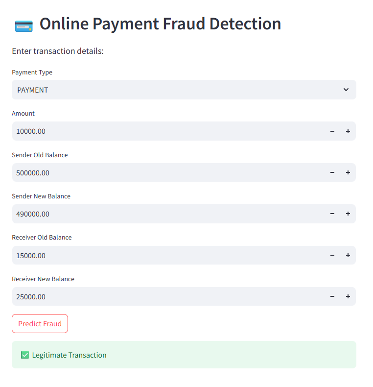
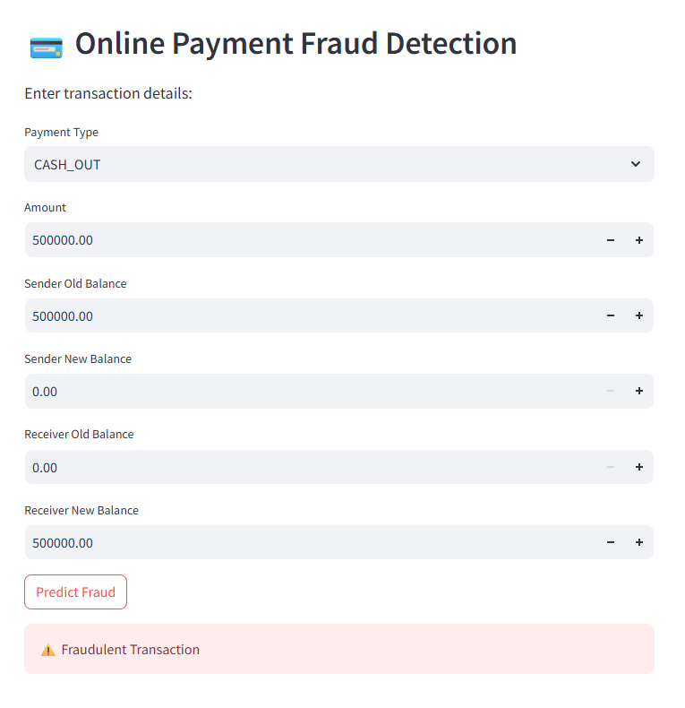

# 🛡️ Online Payment Fraud Detection

## 📌 Project Overview  
This project focuses on building a **fraud detection system** using machine learning.  
We worked with a large dataset of online transactions to identify fraudulent activity, starting from **data preprocessing and exploratory data analysis (EDA)** to **model training and evaluation**.  

The main objective was to compare multiple ML models and identify the most effective approach for fraud detection in highly imbalanced datasets. 

## 🚀 Live Demo  

The fraud detection model has been deployed using **Streamlit** and is publicly accessible.

🔗 **Try the App Here:**  
https://mohd-rushan-online-payment-fraud-detection.streamlit.app/

The app allows users to input transaction details and receive real-time fraud predictions using the trained XGBoost model.

## 🖼️ Application Preview  

<table>
  <tr>
    <td align="center"><b>✅ Legitimate Transaction</b></td>
    <td align="center"><b>⚠️ Fraudulent Transaction</b></td>
  </tr>
  <tr>
    <td></td>
    <td></td>
  </tr>
</table>

---

## ⚙️ Steps Involved  

### 🔍 1. Data Exploration & EDA  
- Inspected dataset structure, data types, and missing values.  
- Visualized fraud distribution, transaction type frequencies, and feature correlations.  
- Identified **heavy class imbalance**: fraud cases are extremely rare compared to non-fraud.  

### 🛠️ 2. Data Preprocessing  
- Applied **one-hot encoding** on categorical features (transaction type).  
- Dropped non-informative columns (`nameOrig`, `nameDest`, etc.).  
- Split dataset into **train & test sets** with stratification to preserve fraud ratio.  

### 🤖 3. Modeling  

To address the severe class imbalance (~0.13% fraud cases), multiple modeling strategies were implemented and compared.

#### Models and Techniques Used:

- **Logistic Regression**
  - Default  
  - `class_weight='balanced'`

- **Random Forest**
  - Default  
  - `class_weight='balanced'`  
  - Balanced Random Forest  

- **XGBoost**
  - Default  

- **Resampling Techniques**
  - SMOTENC + Logistic Regression  
  - SMOTENC + Random Forest  
  - SMOTENC + XGBoost  

Evaluation focused on **Precision, Recall, and PR-AUC**, which are more informative metrics than accuracy or ROC-AUC for highly imbalanced fraud detection datasets. 

### 📊 4. Results  

Since fraud detection prioritizes minimizing missed frauds, **Recall and PR-AUC** were emphasized.

#### 🔎 Model Performance (Fraud Class)

| Model                              | Precision | Recall | PR-AUC | Insight |
|-------------------------------------|----------|--------|--------|---------|
| Logistic Regression (Default)      | 0.92     | 0.36   | 0.5517 | High precision, low recall |
| Logistic Regression (Balanced)     | 0.02     | 0.94   | 0.5456 | High recall, many false positives |
| SMOTENC + Logistic Regression      | 0.02     | 0.95   | 0.5387 | Very high recall, low precision |
| Random Forest (Default)            | 0.97     | 0.77   | 0.9249 | Strong balance |
| Random Forest (Balanced)           | 0.97     | 0.77   | 0.9342 | Slightly improved PR-AUC |
| Balanced Random Forest             | 0.13     | 1.00   | 0.8417 | Perfect recall, low precision |
| SMOTENC + Random Forest            | 0.59     | 0.94   | 0.9050 | Strong trade-off |
| XGBoost (Default)                  | 0.96     | 0.75   | 0.9155 | High precision |
| SMOTENC + XGBoost (0.5 threshold)  | 0.37     | 0.99   | 0.9404 | Highest PR-AUC |
| SMOTENC + XGBoost (0.991 threshold)| 0.79     | 0.89   | 0.9404 | Best balanced model |

### 🌐 5. Deployment  

The final optimized model (**SMOTENC + XGBoost with threshold tuning**) was exported and deployed using **Streamlit Cloud**.

### Deployment Workflow:
1. Trained and finalized the model in Jupyter Notebook  
2. Built an interactive UI using Streamlit  
3. Deployed via Streamlit Cloud  

The application allows real-time fraud detection based on user-provided transaction inputs.

---

## 📂 Repository Structure  
```
📦 fraud-detection
┣ 📜 fraud_detection.ipynb # Model development & experimentation
┣ 📜 fraud_detection_app.py # Streamlit web application
┣ 📜 fraud_detection_model.pkl # Trained XGBoost model
┣ 📜 requirements.txt # Project dependencies
┣ 📜 README.md # Project documentation
```

---

## 📑 Dataset  
The dataset used in this project is publicly available on [Payments Fraud Dataset](https://drive.google.com/file/d/1txKoaCNnIOcwhBdJAM1MPUqEfjYaCZhk/view?usp=drive_link).  

---

## 🏆 Conclusion  

This project explored multiple machine learning approaches for online payment fraud detection while addressing severe class imbalance. Since fraudulent transactions account for only ~0.13% of the dataset, evaluation focused on **Recall and PR-AUC** rather than accuracy alone.

Resampling techniques such as **SMOTENC**, combined with ensemble models like **Random Forest and XGBoost**, significantly improved fraud detection performance.

Among all approaches, **SMOTENC + XGBoost** emerged as the strongest candidate for deployment. With threshold tuning, it achieved approximately:

- **Recall: ~89%**  
- **Precision: ~79%**  
- **PR-AUC: 94.4%**

This project highlights the importance of:

- Properly handling class imbalance  
- Using ensemble methods for robust performance  
- Optimizing classification thresholds based on business requirements  

It demonstrates a production-oriented fraud detection pipeline that balances statistical rigor with real-world deployment considerations.
